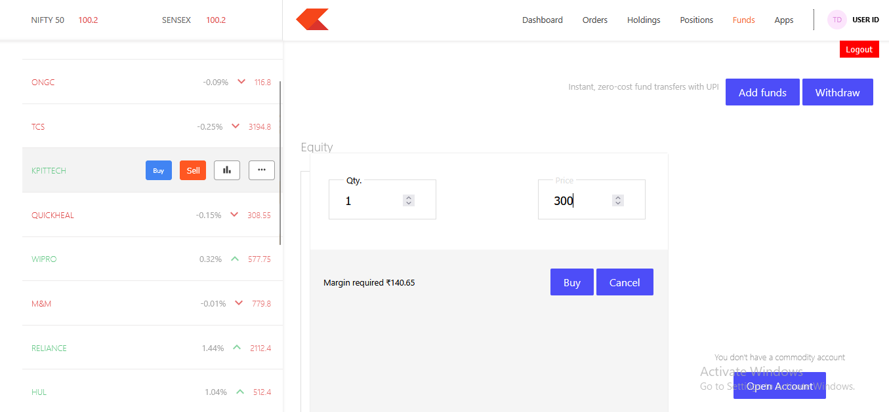

The **TradeDeck (Stock Trading Platform)** is a full-stack web application where users can easily manage basic stock trading activities.  
It provides a simple flow starting from signup/login, exploring stocks, placing buy/sell orders, and viewing them in a separate order list.

### ✨ Key Features
- Secure **user authentication**  
- Easy to use **dashboard with stock list**  
- **Buy/Sell** stocks with real-time updates in the order list  
- Simple **order management system**  
- **Logout** functionality to ensure session security

## 🛠️ Technologies Used

### Frontend
- **React.js** (for building UI)
- **Vite** (fast build tool for frontend)
- **React Router DOM** (for navigation)
- **React Toastify** (for notifications)
- **Chart.js + React ChartJS 2** (for dashboard charts)
- **Bootstrap / Material UI (MUI)** (for styling components)

### Backend
- **Node.js + Express.js** (for server and APIs)
- **MongoDB + Mongoose** (for database and models)
- **Passport.js + JWT** (for authentication & session management)
- **bcrypt / bcryptjs** (for password hashing)
- **dotenv** (for environment variables)
- **CORS & cookie-parser** (for handling requests securely)

## 🚀 How to Start the App

This project has **three separate parts**:  
1. **Frontend** (Landing + Stock listing, Buy/Sell flow)  
2. **Dashboard** (Charts & order summary UI)  
3. **Backend** (APIs, authentication, database handling)  

Follow these steps to run the app locally:

### 1️⃣ Clone the Repository
```bash
git clone <your-repo-link>
cd <your-project-folder>

# Frontend
cd frontend
npm install
npm run dev

# Dashboard
cd ../dashboard
npm install
npm start

# Backend
cd ../backend
npm install
npm start

## 🖼️ Screenshots

### Landing Page


### Buy/Sell Page


### Dashboard


### Orders


### Holdings

